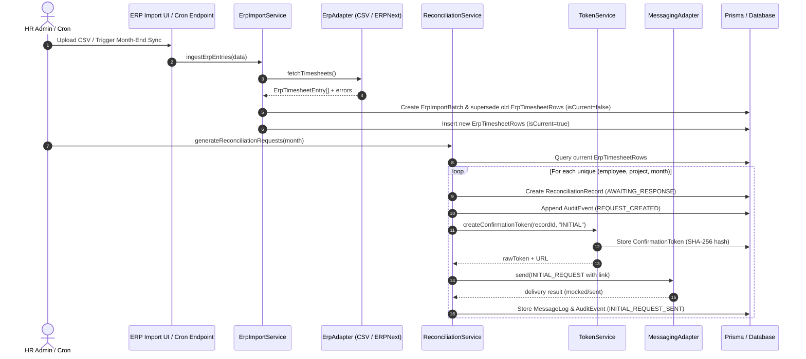
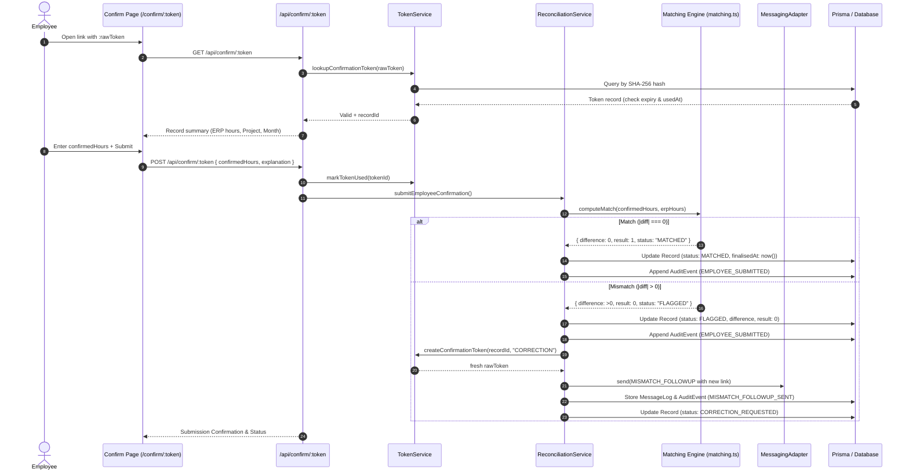
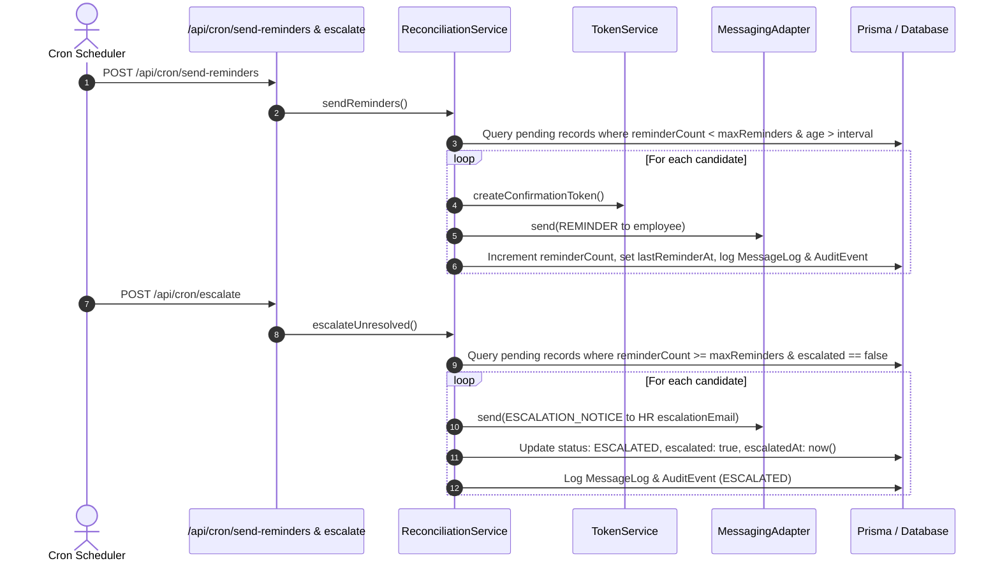
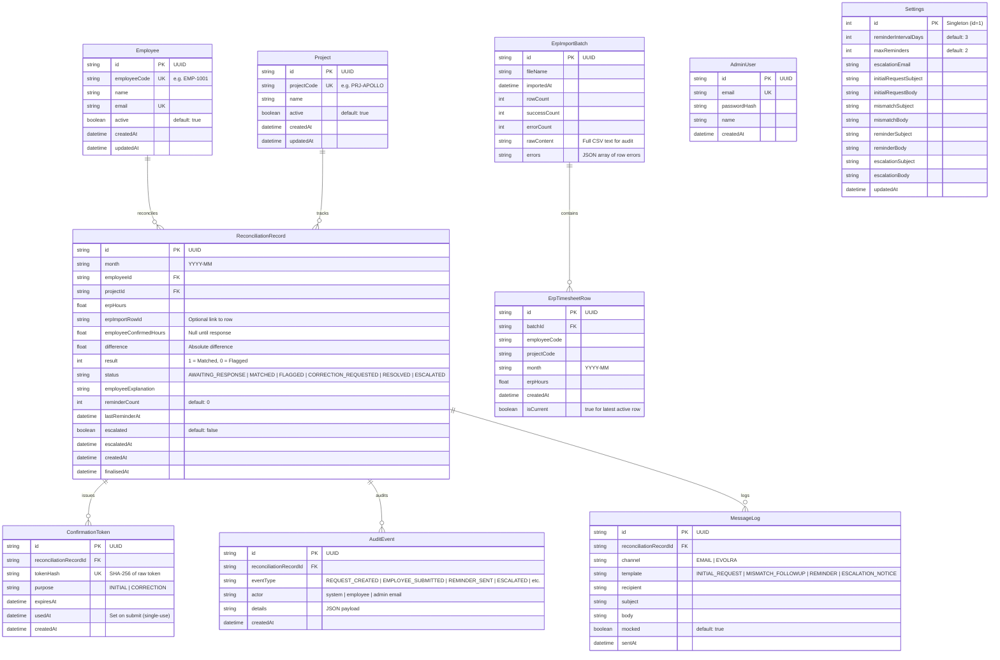

# Project Dependency & Relationship Graph

This document is the structural wiring diagram for the codebase. It maps component hierarchies, API call paths, and database relationships to enable safe refactoring and instant blast-radius analysis.

---

## 1. System Context & Component Graph

```mermaid
graph TD
    subgraph Clients [Clients & Callers]
        Browser[Admin Browser]
        EmployeeLink[Employee Mobile/Desktop Browser]
        CronRunner[Cron / Scheduled CLI Runner]
        ERPWebhook[ERPNext Webhook Sender]
        EvolraWebhook[Evolra Bot Webhook Sender]
    end

    subgraph MiddlewareLayer [Edge Routing & Auth]
        Middleware["src/middleware.ts (Next.js Edge Middleware)"]
    end

    subgraph Presentation [Frontend Presentation Layer]
        AdminShell[AdminShell.tsx]
        DashboardPage[DashboardClient.tsx]
        ReconTable[ReconciliationTableClient.tsx]
        RecordDetail[RecordDetailClient.tsx]
        ErpImportPage[ErpImportClient.tsx]
        SettingsPage[SettingsClient.tsx]
        ConfirmPage["confirm/[token]/page.tsx"]
        StatusBadge[StatusBadge.tsx]
    end

    subgraph APIControllers [API Route Controllers]
        AdminAuthAPI["/api/admin/login, logout, me"]
        DashboardAPI["/api/dashboard"]
        ReconAPI["/api/reconciliation, [id], export, generate"]
        ErpAPI["/api/erp/import, sync-erpnext"]
        ConfirmAPI["/api/confirm/[token]"]
        SettingsAPI["/api/settings"]
        CronAPI["/api/cron/generate-requests, send-reminders, escalate, pull-erpnext"]
        ERPWebhookAPI["/api/erp/webhook/erpnext"]
        EvolraWebhookAPI["/api/webhooks/evolra"]
    end

    subgraph BusinessServices [Core Business Services]
        MatchingEngine["matching.ts (Pure Rule Engine)"]
        ReconService["reconciliationService.ts (Orchestrator)"]
        ErpImportService["erpImportService.ts (Ingestion & History)"]
        TokenService["tokens.ts (Crypto & Token Lifecycle)"]
        AuthService["auth/admin.ts & auth/jwt.ts"]
        CronAuth["cronAuth.ts"]
        TemplateEngine["templates.ts"]
        CsvExporter["csvExport.ts"]
    end

    subgraph Adapters [Integration Adapters]
        ErpAdapterFactory["adapters/erp/index.ts"]
        CsvErpAdapter["adapters/erp/csvAdapter.ts"]
        ErpNextAdapter["adapters/erp/erpNextAdapter.ts"]
        ErpNextAggregation["adapters/erp/erpNextAggregation.ts"]

        MsgAdapterFactory["adapters/messaging/index.ts"]
        EmailAdapter["adapters/messaging/emailAdapter.ts"]
        EvolraChatAdapter["adapters/messaging/evolraChatAdapter.ts"]
    end

    subgraph DataStorage [Data & Persistence Layer]
        PrismaClient["prisma.ts (Prisma Client)"]
        Database[("SQLite (dev.db) / PostgreSQL")]
    end

    Browser --> Middleware
    EmployeeLink --> ConfirmPage
    ConfirmPage --> ConfirmAPI
    CronRunner --> CronAPI
    ERPWebhook --> ERPWebhookAPI
    EvolraWebhook --> EvolraWebhookAPI

    Middleware --> Presentation
    Middleware --> APIControllers

    DashboardPage --> DashboardAPI
    ReconTable --> ReconAPI
    RecordDetail --> ReconAPI
    ErpImportPage --> ErpAPI
    SettingsPage --> SettingsAPI

    DashboardAPI --> PrismaClient
    AdminAuthAPI --> AuthService
    ReconAPI --> ReconService
    ReconAPI --> CsvExporter
    ErpAPI --> ErpImportService
    ConfirmAPI --> TokenService
    ConfirmAPI --> ReconService
    CronAPI --> CronAuth
    CronAPI --> ReconService
    CronAPI --> ErpImportService
    ERPWebhookAPI --> ErpImportService
    EvolraWebhookAPI --> ReconService

    ReconService --> MatchingEngine
    ReconService --> TokenService
    ReconService --> TemplateEngine
    ReconService --> MsgAdapterFactory
    ReconService --> PrismaClient

    ErpImportService --> ErpAdapterFactory
    ErpImportService --> PrismaClient

    ErpAdapterFactory --> CsvErpAdapter
    ErpAdapterFactory --> ErpNextAdapter
    ErpNextAdapter --> ErpNextAggregation

    MsgAdapterFactory --> EmailAdapter
    MsgAdapterFactory --> EvolraChatAdapter

    AuthService --> PrismaClient
    TokenService --> PrismaClient
    PrismaClient --> Database
```

---

## 2. API Route & Call Flow Graphs

### 2.1 ERP Ingestion & Reconciliation Request Generation

### 2.2 Employee Confirmation & Zero-Tolerance Matching

### 2.3 Scheduled Reminder & Escalation Loop

---

## 3. Database Entity-Relationship (ER) Diagram

---

## 4. Blast Radius & Dependency Matrix

Use this table to check downstream impacts before modifying core shared modules:

| Core Module / File | Direct Dependents (Imported By) | Risk Level | Blast Radius Mitigation |
| :--- | :--- | :---: | :--- |
| `src/lib/matching.ts` | `reconciliationService.ts`, `tests/matching.test.ts` | **CRITICAL** | Core zero-tolerance rule. Run unit test suite; do NOT add epsilon or tolerance rounding without an ADR. |
| `prisma/schema.prisma` | `src/lib/prisma.ts`, All Services, DB Migrations | **CRITICAL** | Run `npx prisma migrate dev`, verify schema consistency, update all relation queries and test fixtures. |
| `src/lib/tokens.ts` | `reconciliationService.ts`, `/api/confirm/[token]`, `tests/tokens.test.ts` | **HIGH** | Security & auth boundary. Verify SHA-256 hashing, single-use check (`usedAt`), and expiration validation. |
| `src/lib/reconciliationService.ts` | `/api/reconciliation/*`, `/api/confirm/*`, `/api/cron/*`, `scripts/run-job.ts` | **HIGH** | Core state machine. Run full Vitest suite to verify request generation, reminder counters, and escalation triggers. |
| `src/lib/erpImportService.ts` | `/api/erp/import`, `/api/erp/sync-erpnext`, `/api/erp/webhook/erpnext`, `scripts/run-job.ts`, tests | **HIGH** | Data ingestion integrity. Verify `isCurrent` flag toggling and non-destructive historical retention. |
| `src/middleware.ts` & `src/lib/auth/*` | All protected admin pages, protected `/api/*` endpoints | **HIGH** | Auth & routing. Test valid/invalid JWT cookies, redirect loops, and webhook exemption bypasses. |
| `src/lib/adapters/erp/*` | `erpImportService.ts`, `tests/erpCsvAdapter.test.ts`, `tests/erpNextAggregation.test.ts` | **MEDIUM** | Ingestion parsers. Verify normalization, per-row error handling, and monthly aggregation math. |
| `src/lib/adapters/messaging/*` | `reconciliationService.ts` | **MEDIUM** | Notification delivery. Test template placeholder rendering and mock vs SMTP/Evolra transport. |
| `src/components/AdminShell.tsx` | All admin page views (`dashboard`, `reconciliation`, `erp-import`, `settings`) | **LOW** | Presentation frame. Test sidebar responsiveness, active route styling, and logout flow. |
| `src/components/StatusBadge.tsx` | `ReconciliationTableClient`, `RecordDetailClient` | **LOW** | Visual styling. Check badge color mapping across all 6 `ReconciliationStatus` values. |
| `src/lib/csvExport.ts` | `/api/reconciliation/export`, `tests/csvExport.test.ts` | **LOW** | Export formatting. Verify CSV headers and delimiter escaping. |

